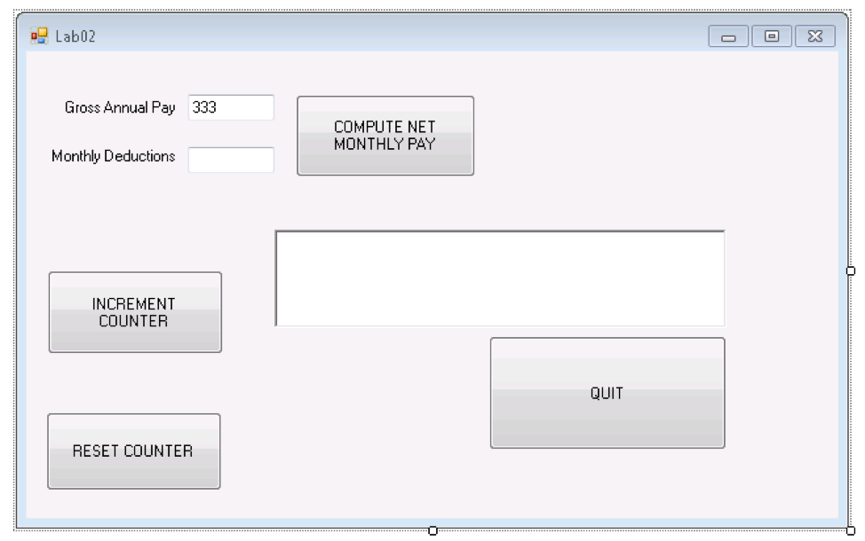
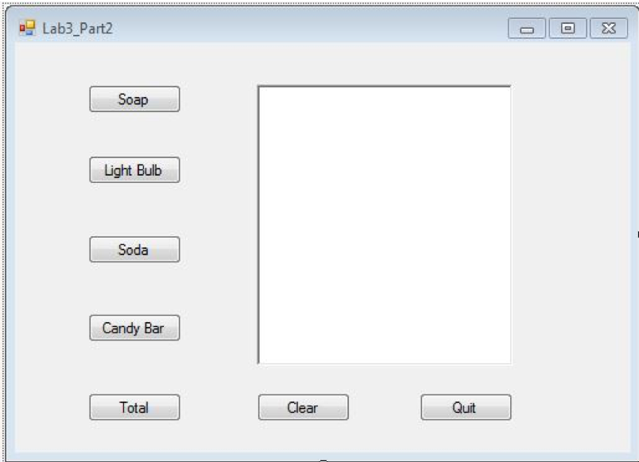

# Topics

* Get familiar with the VS Express 2013 environment
*	String and number variables
*	Assignment statements
*	Evaluating expressions
*	User input: strings and numbers
*	New material for students to learn via online resources: Using format
  strings in Visual Basic

# A straightforward program

1. Launch the **RAPTOR** software and use it to create and save a new program
   called `StraightforwardProgram_Part1.rap` inside the folder
   `StraightforwardProgram` inside of your lab folder.

   Complete `StraightforwardProgram_Part1.rap` so that it prompts the user to
   input a first name and a last name (using two input symbols) and outputs to
   the *MasterConsole* a single line containing the full name input by the user
   formatted as below (for input `John Miller`):

   ```
   Hello Miller, John
   ```

   \BEGIN{Warning}
   When done, save and close file `StraightforwardProgram_Part1.rap`.
   \END{Warning}

1. Launch VS Express 2013 to create a Visual Basic program called
   `StraightforwardProgram_Part2` inside the folder `StraightforwardProgram`
   inside of your lab folder. For directions creating a Visual Basic program in
   VS Express 2013, consult the document **VSExpress2013.pdf**.

   Your created project will contain a single empty Form object by default. In
   the Form properties window (if it is not completely visible, click on the
   Properties tab on the right side of the screen), change the Name property to
   **frmStraightforwardProgram** and Text property to **Straightforward
   Program**. (PS: the Name property of an object CANNOT contain spaces).

   Complete the program `StraightforwardProgram_Part2` so that is the equivalent
   of your RAPTOR program, `StraightforwardProgram_Part1.rap`. It should look
   something like this:

   

   Next, enhance your Visual Basic program to request additional user input.
   Specifically, the user should input the following along with first and last
   name:

   * month of birth
   * day of birth
   * year of birth
   * college
   * major
   * something interesting about themselves

   Then, using the additional user input, the output sentence should be updated
   as well. Your program should now behave identically to the following example
   (given identical input):

   

   \BEGIN{Warning}
   When done, save and close project `StraightforwardProgram_Part2`.
   \END{Warning}

\BEGIN{Rubric}
Part 1 (30/100): A successful `StraightforwardProgram_Part2` program:

* is based on a complete and correct `StraightforwardProgram_Part1.rap` RAPTOR
  program that produces correctly formatted output for input first and last
  name, as in the first example in this exercise
* produces correctly formatted output for sample input described in the second
  example in this exercise

\END{Rubric}

\newpage

# Video rental store

1. Launch the RAPTOR software and use it to create and save a new program called
   `VideoRentalStore_Part1.rap` inside the folder `VideoRentalStore` inside of
   your lab folder. 

   Complete `VideoRentalStore_Part1.rap` to prompt the user to input a
   customer’s full name and the number of videos rented out; compute (and store
   in a new variable) the total cost assuming videos are rented out for a single
   day at a $2.50 per day; and display in the *MasterConsole* the customer name
   and total cost in a nicely formatted message as in the example below,
   assuming the user's full name is `Mary Smith` and `5` videos were rented out:

   ```
   Total cost for Mary Smith is $12.5000
   ```

   \BEGIN{Warning}
   When done, save and close file `VideoRentalStore_Part1.rap`.
   \END{Warning}

1. Launch VS Express 2013 and create a new Visual Basic project called
   `VideoRentalStore_Part2` inside the folder `VideoRentalStore` inside of your
   lab folder.

   Complete program `VideoRentalStore_Part2` so that it is the equivalent of
   your RAPTOR program, `VideoRentalStore_Part1.rap`.

   Next, enhance the Visual Basic program so that it can handle a variable
   number of days. For example, for input `Mary Smith` and `5` videos rented out
   for `3` days, the output becomes: 

   ```
   Total cost for Mary Smith is $37.5000
   ```

   \BEGIN{Warning}
   When done, save and close project `VideoRentalStore_Part2`.
   \END{Warning}

   \BEGIN{Rubric}
   Part 2 (65/100):  A successful `VideoRentalStore_Part2` program:

   * is based on a complete and correct `VideoRentalStore_Part1.rap` RAPTOR
     program that produces correctly formatted output for input customer name
     and number of videos rented out, as shown in the first example in this
     exercise
   * produces correctly formatted output, for input customer name, number of
     videos rented out and number of days, as shown in the second example in
     this exercise
   * must also have successfully completed Part 1 

   \END{Rubric}

   \newpage

1. Use **File Explorer** to navigate to the folder containing your
   final version of your project `VideoRentalStore_Part2` in your lab folder.
   Copy and paste this project in the same folder, and then right-click on the
   copy to rename it as `VideoRentalStore_Part3`. Launch VS Express and use it
   to open the project `VideoRentalStore_Part3`.

   Make the necessary changes to project `VideoRentalStore_Part3` to allow
   customers to rent out premium videos @ $5.25 per day in addition to regular
   videos @ $2.50 per day. The input number of days will apply to both types of
   videos; for example, for 5 regular videos and 3 premium videos rented out for
   3 days, your program would display:

   ```
   Total cost for Mary Smith is $84.75
   ```

   Note that (5 \* 2.50 + 3 \* 5.25) \* 3 = 84.75

   Next, have your program display the output in a meaningful format which
   includes the pretax total and the total after applying a 7% sales tax as in
   the example below:

   Program input: 
   ```
   Enter customer name: XX YY
   Enter number of regular videos (@ $2.50 per day): 5
   Enter number of premium videos (@ $5.25 per day): 3
   Enter number of days: 5
   ```

   Program output:
   ```
   Hello XX YY, your pretax total for 5 regular videos and 3 premium videos for 5 days is $141.25, or $151. 1375 after tax.
   ```

   \BEGIN{Warning}
   When done, save and close project `VideoRentalStore_Part3`.
   \END{Warning}

   \BEGIN{Rubric}
   Part 3 (70/100): A successful `VideoRentalStore_Part3` program:

   * produces correctly formatted output, including pretax and after-tax total
     as in the last example above, for input customer name, number of regular
     videos rented out, number of premium videos rented out and number of days.
   * must also have successfully completed Part 1 

   \END{Rubric}

   \newpage

1. Use your `VideoRentalStore_Part3` program to complete the following test
   table for the different input values shown on the left. This activity is
   known as program testing which is common practice in computer programming.
   The importance of this seemingly tedious activity cannot be overstated!
   Thoroughly testing computer programs under different input scenarios ensures
   they behave as expected especially for "special" cases which are often
   ignored by programmers making programs susceptible to failure. 

   \begingroup
   \renewcommand{\arraystretch}{1.5}
   \begin{tabular}{|p{.10\linewidth}|p{.10\linewidth}|p{.10\linewidth}|p{.28\linewidth}|p{.28\linewidth}|}
    \hline
    \multicolumn{3}{|l|}{\parbox{.34\linewidth}{\vspace{10pt}\textbf{Input
      values for your program} \emph{(run your program for each of the following
      cases; provide a customer name of your own choosing)}}} &
    \parbox{\linewidth}{\vspace{10pt}\textbf{Expected program output for
      after-tax total} \emph{(what output you expect your program to produce for
      the given inputs)}} &
    \parbox{\linewidth}{\vspace{10pt}\textbf{Actual program output for after-tax
      total} \emph{(what output your program actually produces for the given
      inputs)}} \vspace{8pt}\\\hline
    
    \textbf{Number of\newline regular videos} & \textbf{Number of premium
      videos} & \textbf{Number of days} & \emph{please compute by hand and write
      down missing entries (indicated by ???)} & \emph{please write down the
      after-tax total values produced by your program} \\\hline

    3 & 2 & 5 & 96.3   & \\\hline
    1 & 1 & 1 & 8.2925 & \\\hline
    0 & 5 & 1 & ???    & \\\hline
    1 & 0 & 1 & ???    & \\\hline
    0 & 0 & 1 & ???    & \\\hline
    1 & 5 & 0 & ???    & \\\hline
   \end{tabular}
   \endgroup

   \BEGIN{Rubric}
   Part 4 (75/100): A successful part 4:

   - produces correct output: the expected after-tax total MUST match the actual
     after-tax total for all cases in the table
   - must also have successfully completed Part 1 

   \END{Rubric}

## Submission Instructions
During our next lab meeting, you will be asked to expand your solutions to Part
3 and work on new exercise. Prior to the meeting, you are expected to 

* finish ALL parts of this lab, 
* study (again) any material you struggled with in this lab, and
* study new material needed for the next lab

You will submit your work for this lab and the next one together at the end of
our next lab meeting
