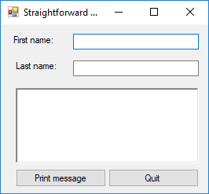

# Objectives
* to use Visual Studio and Visual Basic 2013 to create and run a simple
  program

# Topics
*	String and number variables
*	User input: strings and numbers --- function int()
*	Assignment statements
*	Evaluating expressions
*	Creating output strings by parsing variables and literals: functions
  str()
*	New material for students to learn via online resources: Using format
  Strings in Python
*	New material for students to learn via online resources: function
  random()

# Preliminaries
1. Get a copy of this lab folder from the N: network drive
  1. Go to folder `N:\Classes\CS130\labs` and copy and paste the folder
     for today’s lab (i.e., Lab03) to `M:\CS130\labs`
  1. You may now work locally by opening the write-up from within the
     copied folder. (The write-up is the current document you are
     reading.)
1. For future labs, you may start by copying the proper lab folder right
   away.

# Part 1
1. Launch Visual Basic 2013 by clicking on the start button. Select All Apps >
   Visual Studio 2013 > VS Express 2013 for Desktop. Visual Studio is a platform
   that can be used with many different programming languages. In this course
   we will be programming in Visual Basic 2013.
1. If you start VS Express 2013 and are asked to sign in, you can sign in using
   your CSBSJU email address as your username and your CSBSJU Windows account
   password.  

   **Make sure that you select work or school account and not personal
   account.**
1. To create a new VB project, choose "New Project" from the menu. You
   will see a screen like the one below.

   

   Make sure that Visual Basic has been highlighted under the Templates tab to
   indicate the language you will use and Windows Forms Application is chosen as
   the type of project. Those choices may be the default, but it they are not,
   you can choose the language and type of project to create. Once you have made
   your initial choice to work in Visual Basic (VB), the next time you start
   Visual Studio, it will launch right into the VB environment.

   Give your project a name right away in the **Name:** pane at the  bottom of
   the window. For this project, type in Lab03 for the   name. Now, use the
   **Browse** button to select the desired  **Location:** (folder), you wish to
   save your project in. You will always save your projects on your **M:**
   drive. Do not edit the "Solution name:" pane as it will be automatically
   filled in with the name of the project. _Uncheck_ the **Create directory for
   solution** box in the lower right. Click **OK** to begin your new project.
   This will bring up a window with a new, blank form and several other panels
   with information about the project as you can see in the next figure.      

   At the top of the window is the menu bar and just below it is the toolbar.
   Using choices from either the menu or the toolbar will allow you to do a
   variety of things to your project or form. The tool bar below has icons for
   the most common functions, such as beginning a new project, adding a new item
   to your project such as a form, saving your project, and running your
   project. The icon you will probably use the most is the small green triangle
   near the middle of the toolbar which you click on to debug and run your
   programs.

   

   If the toolbox tab, the properties window, or the Solution Explorer panes are
   not visible, you can use the "View" menu to activate any or all of those to
   be visible. Refer to chapter 3, pages 3-5 of your
   text if you have questions.

   Your created project will contain a single empty Form object by default. In
   the Form properties window (if it is not completely visible, click on the
   _Properties_ tab on the right side of the screen), change the Name property
   to **frmLab03** and Text property to **Lab03**. (PS: the Name property of an
   object CANNOT contain spaces).

1. Your task at this point is to start building the graphical user interface
   for your project. All of the projects for this class require a Quit button on
   the form, so we will start with that.

   Using the Toolbox (if it is not completely visible, click on the _Toolbox_
   tab on the left side of the screen), drag and drop a single button object
   onto the blank form. This will be your _Quit_ button. For every object we add
   to the form, we need to set some of the properties. To do this, put the mouse
   focus on the desired object, in this case the button you just added to the
   form, (i.e., single-click on the button.) When you clicked on the button at
   this point, the Properties window for the button should have appeared on the
   right side of the screen. (If the Properties window is not already completely
   visible, click on the _Properties_ tab on the right side of the screen).  Now
   you can change two of the properties for the button. Change the Name property
   to **btnQuit** and the Text property to **QUIT**.

   At this point, please save all your work by selecting **File>Save All**,
   close Visual Studio altogether, go to where you saved your project folder and
   double click on the file whose type is **Visual Basic Project File**. If
   nothing shows up please double click on the
   form in the menu on the right.

# Part 2


Use Raptor to write a simple program that reads a first name and last name and
displays input with a space in between

1. Convert to Python
1. Change to display: Hello#Last,#First where # represents a single space
1. Change to match the following input and output  

   _Program input:_
```
Enter your first name: Chuck
Enter your last name: Norris
Enter your month of birth: March
Enter your day of birth: 10
Enter your year of birth: 1940
Enter your college: CSBSJU
Enter your major: Chemistry
Enter something interesting about yourself: I was born in China. I like
swimming and dancing
```
   _Program output:_
```
Chuck Norris was born on March 10, 1940. They are a Chemistry major at
CSBSJU. Here is something interesting about them: I was born in China. I
like swimming and dancing.
```

****

D level --- basic I/O using Strings

****

# Part 3


Use Raptor to write a program that reads a customer’s full name and number of
videos rented; computes the total charge assuming videos rented out for one day
@ $2.50 per day; and displays customer name and total charge

1. Convert to Python formatted like (for 5 videos): Total charge for Mary Smith
   is $12.50
1. Change to make number of days a variable input by the user and display
   updated info (for 5 videos rented out for 3 days): Total charge for Mary
   Smith is $37.50
1. Change to allow customer to rent out premium videos @ $5.25 per day in
   addition to regular videos @ $2.50 per day. The input duration will apply to
   both types of videos. (for 5 regular videos and 3 premium videos rented out
   for 3 days): Total charge for Mary Smith is $84.75
1. Change to display a meaningful message with pretax total and after applying
   a 7% sales tax like the following.

   _Program input:_
```
Enter customer name: XX YY
Enter number of regular videos (@ $2.50 per day): 5
Enter number of premium videos (@ $5.25 per day): 3
Enter number of days: 5
```
   _Program output:_
```
Hello XX YY, your pretax total for 5 regular videos and 3 premium videos for
5 days is $141.25, or $151.1375 after tax.
```

1. Test your program for additional inputs below:  

   -----------------------------------------------------------------------------
   regular  premium  days    expected after tax total: actual after tax total:
   videos   videos           compute by hand           show what your program
                                                       displays
   -------- -------- ------- ------------------------- -------------------------
   3        2        5       96.3

   1        1        1       8.2925

   0        5        1       28.0875

   1        0        1       2.675

   0        0        1       0.0

   1        5        0       0.0
   -----------------------------------------------------------------------------

1. Redo last step using format strings in Python. $ values MUST be round off to
EXACTLY two decimal places.

****

C level --- I/O using Strings and numbers. Includes evaluating expressions, python format strings and testing

****

# Part 4


1. Extend program to allow user to purchase the following additional items
   during checkout: candy @ $1.50, popcorn @ $5.00 a bag, and soda @ $2.25.
   Program should now request number purchased for each item and display an
   itemized receipt as below. All $ values MUST be round off to EXACTLY two
   decimal places.

   _Example:_
```
3 x regular videos for 5 days @ $2.50 per day: $37.50
2 x premium videos for 5 days @ $5.25 per day: $52.50
0 x candy @ $1.50 each:	 $0.00
2 x popcorn @ $5.00 each: $10.00
3 x soda @ $2.25 each: $6.75
-----------------------------------------------------
Pretax Total: $ 106.75
Total after tax: $ 114.22
```

****

B level --- More complex version of C level. Studying & applying online
resources  

****
