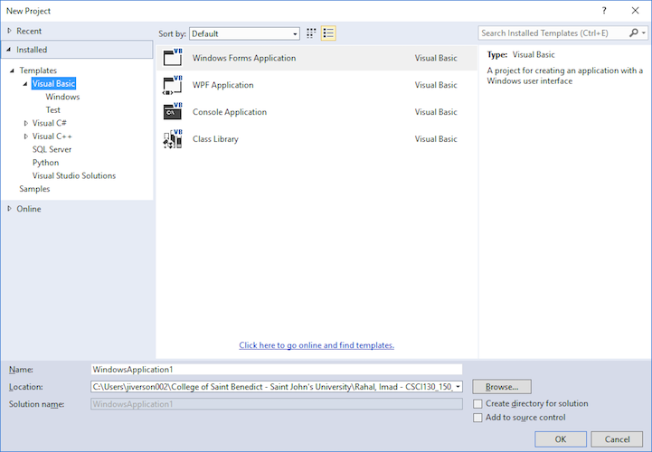

# Creating programs with VS Express 2013

1. Launch **VS Express 2013** by clicking the Windows search button and
   searching for "VS Express 2013 for Desktop". VS Express is a platform that
   can be used with many different programming languages. In this course we will
   be programming in Visual Basic.

1. To create a new VB project, choose "New Project" from the menu. You
   will see a screen like the one below.

   

   Make sure that **Visual Basic** has been highlighted under the Templates tab
   to indicate the language you will use and **Windows Forms Application** is
   chosen as the type of project. Those choices may be the default, but it they
   are not, you can choose the language and type of project to create. Once you
   have made your initial choice to work in Visual Basic (VB), the next time you
   start VS Express, it will launch right into the VB environment.

   Give your project a name right away in the **Name:** pane at the bottom of
   the window. Then use the **Browse** button to select the desired
   **Location:** (folder), you wish to save your project in. Do not
   edit the "Solution name:" pane as it will be automatically filled in with the
   name of the project. **Uncheck** the **Create directory for solution** box in
   the lower right. Click **OK** to begin your new project. This will bring up a
   window with a new, blank form and several other panels with information about
   the project as you can see in the next figure.

   At the top of the window is the menu bar and just below it is the toolbar.
   Using choices from either the menu or the toolbar will allow you to do a
   variety of things to your project or form. The tool bar below has icons for
   the most common functions, such as beginning a new project, adding a new item
   to your project such as a form, saving your project, and running your
   project. The icon you will probably use the most is the small green triangle
   near the middle of the toolbar which you click on to debug and run your
   programs.

   If the toolbox tab, the properties window, or the Solution Explorer panes are
   not visible, you can use the View menu to activate any or all of those to
   be visible. Refer to chapter 3, pages 3-5 of your text if you have questions.
   Your created project will contain a single empty Form object by default.
