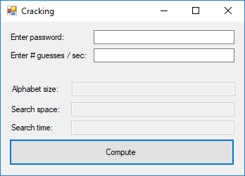

# Topics

* if/else statements
* testing the "randomness" of random numbers
* introduction to concept of string patterns
* creating your own test cases to verify the correctness of a program

# Preliminaries
If you haven’t already done so, start by making a copy of today’s lab folder
(Lab04) and saving it in your `M:\CS130\Labs` folder. Right-click on the folder
you just copied and rename it `Lab04_YourLastName_YourFirstName` (but use your
actual last and first names).

You may now work locally by opening the write-up from within the copied folder.

# Flipping a coin

1. Launch the RAPTOR software and use it to create and save a new program called
   `FlippingACoin_Part1.rap` inside the folder `FlippingACoin` inside of your
   lab folder.

   Complete `FlippingACoin_Part1.rap` so that it generates a random number
   between 0 and 1, exclusive, and prints `"Heads"` when the number is less than
   `0.5` and `"Tails"` otherwise (i.e., it is greater than or equal to `0.5`).

   \BEGIN{Warning}
   When done, save and close file `FlippingACoin_Part1.rap`.
   \END{Warning}

1. Launch VS Express 2013 and open the program `FlippingACoin_Part2` which can
   be found inside of the folder `FlippingACoin` inside of your lab folder.

   Complete the program `FlippingACoin_Part2` so that is the equivalent
   of your RAPTOR program, `FlippingACoin_Part1.rap`.

   Run this program 20 times and record below the number of *Heads* and number
   of *Tails*:

   * number of *Heads*: ______ out of 20 flips
   * number of *Tails*: ______ out of 20 flips

   Does it look like a fair coin (in the sense that the coin is just as likely
   to generate *Heads* as *Tails*)?

   \BEGIN{Warning}
   Your program should behave identically to the solution which can be run by
   double-clicking the file `FlippingACoin_Part2.exe` found in the `Executables`
   folder inside of your lab folder.

   When done, save and close program `FlippinACoin_Part2`.
   \END{Warning}

   \BEGIN{Rubric}
   Checkpoint 1 (30/100): A successful `FlippingACoin_Part2` program:

   * is based on a complete and correct `FlippingACoin_Part1.rap` program that
     displays Heads and Tails based on your user
   * simulates a fair coin 

   \END{Rubric}

   \newpage

1. Use **File Explorer** to navigate to the folder containing the final version
   of your program `FlippingACoin_Part2` in your lab folder. Copy and paste this
   program in the same folder, and then right-click on the copy to rename it as
   `FlippingACoin_Part3`. Launch VS Express and use it to open the program
   `FlippingACoin_Part3`.

   Make the necessary changes to program `FlippingACoin_Part3` to simulate a
   **biased** coin instead of a fair one. When flipped, this biased coin is
   three times more likely to generate Heads than Tails (Hint: recall that you
   the value `0.5` from the previous part was chosen to split the range `[0,1)`
   perfectly in half).

   Run this program 20 times and record below the number of *Heads* and number
   of *Tails*:

   * number of *Heads*: ______ out of 20 flips
   * number of *Tails*: ______ out of 20 flips

   Does it look like a fair coin or a biased coin now?

   \BEGIN{Warning}
   Your program should behave identically to the solution which can be run by
   double-clicking the file `FlippingACoin_Part3.exe` found in the `Executables`
   folder inside of your lab folder.

   When done, save and close program `FlippinACoin_Part3`.
   \END{Warning}

   \BEGIN{Rubric}
   Checkpoint 2 (65/100): A successful `FlippingACoin_Part3` program:

   * simulates a biased coin that is three times more likely to generate *Heads*
     than *Tails*

   \END{Rubric}

\newpage

# Password crack calculator

**Disclaimer.** The program that you develop for this exercise should **NOT** be
considered a measure of the strength of a particular password. An obvious
example would be the password '*P@ssw0rd*', which, according to the program,
would take 147.53338 centuries to crack, but in practice would be among the
first passwords checked by any cracker worth their salt.

## TL;DR
Implement a program to calculate the number of passwords that can be constructed
from some alphabet, as well as the time it would take to check the entire search
space assuming a cracking program capable of some number of guesses per second.

This exercise will give you a better understanding and appreciation for password
composition.

## Background
Have you ever wondered why many websites have password requirements like:

* be a minimum of 8
* cannot be based on a word or name
* must contain at least one
  * upper-case letter,
  * lower-case letter,
  * number, and
  * special character: ! $ / % @ #
  
These are all attempts to prevent users from choosing passwords that are easy to
guess. Keep in mind, that in this context, it is not a person guessing, but
rather a machine running a
[*cracking*](https://en.wikipedia.org/wiki/Password_cracking) program, capable
of thousands or millions of guesses per second. It turns out that when
requirements like this are not enforced, people tend to pick easily guessable
passwords. According to a variety of sources, some of the most popular passwords
are:

* password
* 123456
* qwerty
* monkey
* password1

By requiring the inclusion of certain groups of characters, it prevents the use
of passwords such as those listed above, at least in their most obvious form. If
a cracking program is unable to quickly guess a password based on a dictionary
of common passwords, such as those above, it may be necessary to use
[*brute-force*](https://en.wikipedia.org/wiki/Brute-force_attack) to guess the
password, i.e., check all possible passwords that satisfy the requirements.

A useful exercise for any person interested in the security of their password
protected identity is to determine how many possible passwords could be
constructed from a given set of requirements, and how long it would take a
computer cracking program to check all such passwords.

Your task is to create a Visual Basic program that does just that. Your program
will take a password as input, then compute the number of possible passwords,
called the *search space*, that use the same types of characters as the input
password. Then your program will output that search space, along with the amount
of time for a computer capable of checking a certain number of passwords per
second would take to crack the input password.

To start, let's define the *password alphabet*. The *password alphabet* is the
set of letters, numbers, and other characters that are allowed to be used to
compose a password. So for example, if only lower-case letters were allowed in a
password, then the alphabet would be a-z and its size would be 26. However, if
upper-case letters as well as numbers were allowed, then the alphabet would be
a-z, A-Z and 0-9, and its size would be 62.

Given this definition, then the total number of passwords of length *L* that can
be created from an alphabet of size *C* can be expressed as:

(@) $$C^L$$

Since a cracking program does not know a priori how many characters are in the
password it is trying to crack, it will have to check not only those passwords
of length *L*, but also those password whose length is less than *L*. Thus,
using equation (1), the *search space* for a password of length *L* can be
expressed as:

(@) $$(C^1+C^2+\dots+C^L)=C(C^L-1)/(C-1)$$

Given a cracking program capable of checking *G* passwords per second, the time
it would take (in seconds) to check all passwords in a search space of that size
can be expressed as:

(@) $$(C(C^L-1)/(C-1))/G$$

Keep in mind that this is not an indication of how long it would take to crack a
particular password, only of how long to check the entire search space. It is
conceivable that any given password will be found in less time than that
calculated. Still, it allows one to compare the effect of alphabet size and
password length on the search space and time.

## Instructions

1. Launch VS Express 2013 and open the program `PasswordCrackCalculator_Part1`
   which can be found inside of the folder `PasswordCrackCalculator` inside of
   your lab folder.

   

   You are to write a program that accomplishes the tasks described in the
   previous section. The interface for your program should match that of the
   example above.

   Before you can even think about computing the size of the search space and
   how long it would take to check, you must determine the size of the alphabet.
   For this problem, the alphabet will be dictated by the
   password entered by the user.

   For example, if the user entered the password `PASSWORD`, then the alphabet
   size would be 26 because `PASSWORD` only contains upper-case letters, of
   which there are 26. However, if the user had entered `PaSSwORD`, then the
   alphabet size would be 52 because `PaSSwORD` contains both upper- and
   lower-case letters.

   Any valid password entered by the user can only contain characters belonging
   to one of the following character types:

   * lower-case letters [a-z],
   * upper-case letters [A-Z],
   * digits [0-9], and
   * special characters [!$/%@#].

   To compute the total size of the alphabet based on the user input password,
   determine which character types are included in the user's password and add
   an amount appropriate for that character type to a variable called
   `alphabetSize`.

   To find out if a
   [`String`](https://docs.microsoft.com/en-us/dotnet/visual-basic/language-reference/data-types/string-data-type)
   contains any one of a set of characters, you can use the
[`Like`](https://docs.microsoft.com/en-us/dotnet/visual-basic/language-reference/operators/like-operator)
   operator. For example, to check if the `String` variable `passwd` contains
   any lower-case letters and add the appropriate amount to the variable
   `alphabetSize` if it does, you should use the following Visual Basic code:

   ```vbnet
        If passwd Like "*[a-z]*" Then
            alphabetSize = alphabetSize + 26
        End If
   ```

   The correct pattern for each of the different characters types is as
   follows:

   * lower-case letters `"*[a-z]*"`,
   * upper-case letters `"*[A-Z]*"`,
   * digits `"*[0-9]*"`, or
   * special characters `"*[^$/%@#]*"`.

   Complete `PasswordCrackCalculator_Part1` so that it takes a user input
   password and computes and outputs the alphabet size based on the user's
   input. After you get your program working, fill out the following table,
   making sure that your expected output and actual output are consistent.

   \begingroup
   \renewcommand{\arraystretch}{1.5}
   \begin{tabular}{|p{.3\linewidth}|p{.3\linewidth}|p{.3\linewidth}|}
    \hline
    \multicolumn{3}{|c|}{\textbf{Test Table 1}}\\\hline
    \textbf{Input values for your program} \emph{(run your program for each of
      the following cases)} &
    \textbf{Expected program output for alphabet size} \emph{(what output you
      expect your program to produce for the given input --- please compute by
      hand and write down missing entries [indicated by ???])} &
    \textbf{Actual program output for alphabet size} \emph{(what output your
      program actually produces for the given inputs)}\\\hline

    \texttt{"aaaa"} & 26  & \\\hline
    \texttt{"AAAA"} & 26  & \\\hline
    \texttt{"1111"} & ??? & \\\hline
    \texttt{"!!!!"} & ??? & \\\hline
    \texttt{"aA1!"} & ??? & \\\hline
   \end{tabular}
   \endgroup

   \BEGIN{Warning}
   Your program should behave identically to the solution which can be run by
   double-clicking the file `PasswordCrackCalculator_Part1.exe` found in the
   `Executables` folder inside of your lab folder.

   When done, save and close program `PasswordCrackCalculator_Part1`.
   \END{Warning}

   \BEGIN{Rubric}
   Checkpoint 3 (70/100): A successful `PasswordCrackCalculator_Part1` program:

   * produces correct output for all test cases in Test Table 1
   * must also have successfully completed Checkpoint 2

   \END{Rubric}

   \newpage

1. Use **File Explorer** to navigate to the folder containing the final version
   of your program `PasswordCrackCalculator_Part1` in your lab folder. Copy and
   paste this program in the same folder, and then right-click on the copy to
   rename it as `PasswordCrackCalculator_Part2`. Launch VS Express and use it to
   open the program `PasswordCrackCalculator_Part2`.

   Enhance your program so that instead of outputting just the alphabet size, it
   outputs the search space size as well. To do this, first recall the equation
   for computing the search space size,

   $$C(C^L-1)/(C-1),$$

   where $C$ is the alphabet size and $L$ is the length of the password. Since
   you computed the alphabet size in Part 1, you are just missing the length
   $L$. Luckily this information is easily ascertained from the user input
   password with the following line of Visual Basic, assuming you are using
   variables, `passwd` and `passwdLength` to store the input password and its
   length respectively:

   ```vbnet
   passwdLength = passwd.Length
   ```

   One of the most important tasks when developing a piece of software is to
   test it to ensure its correctness. To this end, you should expand Test Table
   1 with additional inputs values that will test your code under different
   conditions.

   Be judicious about your choice of test cases, so that you are not repeating
   calculations that will ultimately produce the same results. For example, it
   is probably not necessary to check both `"aaaa"` and `"bbbb"` since they
   define the same alphabet and have the same length.

   If you are satisfied with your set of test cases and your program is
   producing correct results, then your set of test cases is inadequate. If you
   have found a test case for which your program produces incorrect output, or
   you cannot come up with any such cases after thinking about it for some time,
   then you should download and run this [testing program](TODO).

   To run the test program ... This will run your program using a pre-defined
   set of test cases and report whether or not your program produced the correct
   output. The testing program should report two failures (test8 and test9). If
   it reports more, then you should address each of them until only these two
   remain.
   Getting your program to produce correct results for test8 and test9 will be
   the subject of our next lab meeting. For now, it is enough that you consider
   why this might be happening.

   \BEGIN{Warning}
   Your program should behave identically to the solution which can be run by
   double-clicking the file `PasswordCrackCalculator_Part2.exe` found in the
   `Executables` folder inside of your lab folder.

   When done, save and close program `PasswordCrackCalculator_Part2`.
   \END{Warning}

   \BEGIN{Rubric}
   Checkpoint 4 (75/100): A successful `PasswordCrackCalculator_Part2` program:

   * produces correct results for all test cases except test8 and test9
   * must also have successfully completed Checkpoint 2

   \END{Rubric}

   \BEGIN{Submission}
   **Submission Instructions**

   During our next lab meeting, you will be asked to expand your solutions to
   Part 2. Prior to the meeting, you are expected to

   * finish ALL parts of this lab,
   * study (again) any material you struggled with in this lab, and
   * study new material needed for the next lab

   You will submit your work for this lab and the next one together at the end
   of our next lab meeting.
  \END{Submission}
