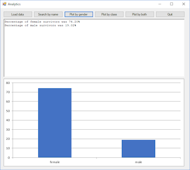

\renewcommand{\arraystretch}{1.5}

# Topics
* Reading from CSV files into parallel arrays
* Match and stop searching including handling "no match" situations
* Exhaustive searching including handling "no match" situations
* Answering questions using data
* Boolean datatype
* Using compound conditions
* Counting to analyze data
* Using nested loops

# Instructions
5. Copy and paste the folder `Searching_Part4`. Rename the copy
   `Searching_Part5`. Launch the VS Express 2013 software and open the project
   `Searching_Part5`.

   Complete the action for `btnPlotByClass` to request a passenger class value
   as input from the user and count and display the number of passengers in that
   class who survived. You MUST use exhaustive searching. Test your program for
   the following input cases and make sure it produces the expected output shown
   in Table 3.

   \vspace{1ex}
   \begin{tabularx}{\linewidth}{|l|X|}
    \hline
    \multicolumn{2}{|l|}{\textbf{Table 3}}
    \\\hline
    \textbf{Input values for class} & \textbf{Expected program output}\\\hline
    \texttt{3} & \texttt{119}\\\hline
    \texttt{2} & \texttt{87}\\\hline
    \texttt{1} & \texttt{136}\\\hline
   \end{tabularx}
   \vspace{1ex}

   Now, instead of displaying the count of matching passengers in the input
   class, modify your program to compute and print the percentage of survivors
   rounded to two decimal places. Test your program for the following input
   cases and make sure it produces the expected output shown in Table 4.

   \vspace{1ex}
   \begin{tabularx}{\linewidth}{|l|X|}
    \hline
    \multicolumn{2}{|l|}{\textbf{Table 4}}
    \\\hline
    \textbf{Input values for class} &
      \textbf{Expected program output}\\\hline 
    \texttt{3} & \texttt{24.44\%}\\\hline
    \texttt{2} & \texttt{47.28\%}\\\hline
    \texttt{1} & \texttt{62.96\%}\\\hline
   \end{tabularx}
   \vspace{1ex}

   Do the results in the table above validate part or all the statement: "*one
   of the reasons that the shipwreck led to such loss of life was that there
   were not enough lifeboats for the passengers and crew. Although there was
   some element of luck involved in surviving the sinking, some groups of people
   were more likely to survive than others, such as women, children, and the
   upper-class passengers.*" Please discuss this with a nearby classmate.

   How would your program behave if you run it for input class 4? Try it. Are
   your getting an error? If so, why are you getting this error? Instead of an
   error, fix your program to display a suitable error message if the input
   class is not valid. Make sure your program still produces the expected output
   for all valid input class values in Table 4 above.

   \BEGIN{Rubric}
   Checkpoint 5 (80/100)
   * project uses exhaustive searching
   * project produces correct search output for any passenger class, even those
     that do not exist
   * project produces correct output for all test cases in Table 4

   \END{Rubric}

   \newpage

1. Copy and paste the folder `Searching_Part5`. Rename the copy
   `Searching_Part6`. Launch the VS Express 2013 software and open the project
   `Searching_Part6`.

   Complete the action for `btnPlotByGender` so that it finds the percentage of
   survivors by gender (i.e., percentage of women survivors and percentage of
   men survivors) and prints the results in statements with the following
   format:

   ```
   Percentage of female survivors was 74.20%
   Percentage of male survivors was 19.02%
   ```

   \BEGIN{Rubric}
   Checkpoint 6 (85/100)
   * project uses exhaustive searching with a Boolean variable
   * project produces correct output for file `Titanic.csv`

   \END{Rubric}

   \newpage

1. The project `Plots` inside your lab folder contains a simple data
   visualization project that produces a bar chart using Excel's plotting
   functionality from within a Visual Basic project. Open this project and run
   it to see the output it produces&mdash;by the way, this is the actual average
   cumulative GPAs of juniors and seniors for six departments at CSBSJU from
   Academic Year 2017-18.  Study the code carefully.

   Copy and paste the folder `Searching_Part6`. Rename the copy
   `Searching_Part7`. Launch the VS Express 2013 software and open the project
   `Searching_Part7`.

   Update the action for `btnPlotByGender` to produce a bar chart for the
   percentage of survivors by gender like the one shown below. You will need to
   figure out a way to store the data needed on the bar chart's x-axis and
   y-axis in two arrays as is done in the sample project, `Plots`. Please note
   that while gender values won't change, the percentage of survivors is likely
   to change depending on the data read from the input file and thus can't be
   hard coded in your program; your program should work correctly for ANY valid
   input file.

   \vspace{1ex}
   
   \vspace{1ex}

   Does this verify the claim that certain groups of people, such as women, were
   more likely to survive than others? Please discuss this with a nearby
   classmate.

   \BEGIN{Rubric}
   Checkpoint 7 (90/100)
   * project uses data from file `Titanic.csv` to produce the correct bar chart
     for percentage of survivors by gender

   \END{Rubric}

   \newpage

1. Copy and paste the folder `Searching_Part7`. Rename the copy
   `Searching_Part8`. Launch the VS Express 2013 software and open the project
   `Searching_Part8`.

   Update the action for `btnPlotByClass` so that it produces the following bar
   chart for the percentage of survivors by passenger class. Again, the
   percentage of survivors might change depending on the data read from the file
   and thus can't be hard coded in your program.

   \vspace{1ex}
   
   \vspace{1ex}

   \BEGIN{Rubric}
   Checkpoint 8 (100/100)
   * project uses data from file `Titanic.csv` to produce the correct bar chart
     for percentage of survivors by class

   \END{Rubric}

   \newpage

1. As the number of values or labels on the x-axis increases, the program
   becomes more complex needing many counters as well as branches in the
   `if`-statement inside the loop used to distinguish among the labels. One way
   to simplify the code is to loop over the labels on the x-axis, and for each
   label, loop over the data in order to count survivors and total matches for
   that specific label. This way, only one if statement and two counters are
   needed (one for the total matches and another for survivors) provided they
   are reset back to zero for every new label. This solution uses a nested loop;
   there are definitely other ways to arrive at the same outcome and probably
   more efficiently, but we are more interested in simplicity at this stage.

   Copy and paste the folder `Searching_Part8`. Rename the copy
   `Searching_Part9`. Launch the VS Express 2013 software and open the project
   `Searching_Part9`.

   Complete the action for `btnPlotByBoth` so that it will produce the same bar
   chart from the previous step only using the nested loop logic described in
   this part.

1. Copy and paste the folder `Searching_Part9`. Rename the copy
   `Searching_Part10`. Launch the VS Express 2013 software and open the project
   `Searching_Part10`.

   Update the action for `btnPlotByBoth` using the same logic from the previous
   part to produce a bar chart for the percentage of survivors by gender and
   passenger class COMBINED. 

   You will now need to use nested loops to go over both arrays (gender values
   array and passenger class values array) to create the labels for the x-axis
   before looping over the data to count (using yet another nested loop). The
   expected outcome is shown below. Have fun!

   \BEGIN{Rubric}
   Checkpoint EC (110/100)
   * project uses data from file `Titanic.csv` to produce the correct bar chart
     for percentage of survivors by gender AND passenger class

   \END{Rubric}

   \BEGIN{Submission}
   **Submission Instructions**

   Your `M:\CS130\Labs\Lab07_YourLastName_YourFirstName` folder should contain
   your solutions to this and Tuesday's lab.

   To submit your work, copy this folder and paste it to
   `N:/Handins/CS130/Lab07_Searching` PRIOR to midnight tonight. Submissions
   received after 11:59pm tonight will be considered late and will receive a
   grade of 0.

   You are not allowed to seek help from TAs on this lab outside lab time. TAs
   have been specifically instructed NOT to provide any help so please refrain
   from this activity.
   \END{Submission}
