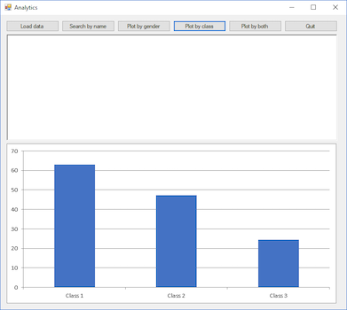

# Part 1

## Learning objectives
This exercise is designed to help you learn about (and assess whether you have
learned about):

* Reading from CSV files into parallel arrays
* Match and stop searching including handling "no match" situations
* Exhaustive searching including handling "no match" situation
* Using compound conditions
* Counting to analyze data and answer queries
* Plotting using Excel within Visual Studio
* Using nested loops

## Background
On April 15, 1912, the RMS Titanic sank due to a collision with an iceberg. Out
of 2224 passengers and crew members, only 722 survived. This incident became one
of the most infamous shipwreck stories in history, which led to improved safety
standards for ships.

According to [this](https://www.kaggle.com/c/titanic), "*one of the reasons that
the shipwreck led to such loss of life was that there were not enough lifeboats
for the passengers and crew. Although there was some element of luck involved in
surviving the sinking, some groups of people were more likely to survive than
others, such as women, children, and the upper-class passengers.*"

## Instructions
In this lab, we will analyze data on a sample of 887 Titanic passengers to
evaluate some of the above statements. The data is included in this lab folder
in file `Titanic.csv`; it contains the following six columns in the order shown
below:

* Passenger ticket class: 1 = first class, 2 = second class, 3 = third class
* Gender
* Passenger name
* Age in years
* Fare paid for ticket in British pounds
* Survival status: 1 = survived, 0 = died

The lab folder also contains a smaller version of the data in file
`TitanicSmaller.csv`. This version has only ten rows and the first two columns
(passenger ticket class and gender); it will prove useful for testing purposes.
Please take some time to study BOTH files.

1. File `Searching_Part1.rap` contains an incomplete attempt to read data from
   input TitanicSmaller.csv. Complete the program to read all rows from the
   input file into list rows (already created for you) and count (using your own
   variable) and report the total rows in the file (should be 10). When done,
   run your program on file `Titatnic.csv`. Are you getting 887 rows now?

1. Convert your Raptor program into VB. Again, count the total number of
   rows read (use your own variable for this purpose) and report the rows in
   BOTH files. Make sure you are getting the correct answers before you proceed.

1. Extend your program to read data from file `TitanicSmaller.csv` and store all
   passenger ticket class values in an array called `ticketClass` and gender
   values in an array called `gender` -- it should be clear that `ticketClass`
   and `gender` are parallel arrays. Display the values in both arrays
   side-by-side with a single space between the ticket class value and the
   gender value for each passenger similar to how the data appears in the data
   file. Verify you are getting the following output formatted EXACTLY as shown
   below:

   ```
   3 male
   1 female
   3 female
   1 female
   3 male
   3 male
   1 male
   3 male
   3 female
   2 female
   Total rows in the file: 10
   ```

   Run your program on the longer file and verify that it is reading all rows.

1. Extend your program to read all six columns from file `Titanic.csv` and store
   all values for each column in a separate list – you will now need to use a
   total of six parallel lists. Display the values in ALL lists side-by-side
   with a single space between the values for each passenger similar to how the
   data appears in the data file.

* * *
D level -- reading from csv files into parallel arrays

* * *

1. Extend your program to use the lists containing the data read from file
   `Titanic.csv` in order to search for passenger "*Miss. Laina Heikkinen*" and
   display her ticket class, age, fare paid, and her survival status. YOU MUST
   USE MATCH AND STOP SEARCHING. Verify that your program displays correct
   information:  `3 26 7.93 1`

1. Extend your program so that it displays "SURVIDED" if passenger survived
   (instead of a 1) or "DIED" otherwise (instead of a 0). You should see the
   following output: `3 26 7.93 SURVIVED`

1. Extend your program so that it displays information on ANY passenger given a
   complete name input by the user. An error message should be displayed if the
   input name is not valid. Test your program for the following input strings:

   * *Miss. Laina Heikkinen* (Expected output: `3 26 7.93 SURVIVED`)
   * *Mr. James Moran* (Expected output: `3 27 8.46 DIED`)
   * *Madam not in file* (Expected output: `Madam not in file PRODUCED NO
     MATCHES`)

* * *
C level -- applying match and stop searching on data read from csv files into
parallel arrays; dealing with "NO MATCH" situations

* * *

1. Create a new program that uses the lists containing the data read from file
   `Titanic.csv` in order to count and display the number of class 3 passengers
   who survived (answer should be 119). When done, change the program to report
   the percentage (instead of count) of class 3 passengers who survived
   **(answer should be ????)**. Format output to two decimal places.

1. Extend your program to accept a passenger class value as input from the user
   and find the percentage of survivors and average age of survivors for the
   input class. Try your program for the following class values and complete the
   test table.

   ```
   TODO: INSERT TABLE HERE
   ```

   Do results from this part validate part or all the statement: "*one of the
   reasons that the shipwreck led to such loss of life was that there were not
   enough lifeboats for the passengers and crew. Although there was some element
   of luck involved in surviving the sinking, some groups of people were more
   likely to survive than others, such as women, children, and the upper-class
   passengers.*" Please explain.

1. What do you expect would happen if you run your program for input class 4?
   Try it. Why are you getting this error? Now fix your program to display a
   suitable error message if input class is not valid. Make sure your program
   still produces correct output for all three valid input class values.

* * *
B level -- applying exhaustive searching on data read from csv files into
parallel lists; dealing with "NO MATCH" situations; compound conditions; using
data to validate statements

* * *

1. A simple data visualization program that produces a bar chart using Excel
   within Visual Studio is provided to you in the folder `Plots`. Run the
   program to see the output it produces–by the way, this is the actual average
   cumulative GPAs of juniors and seniors for six departments at CSBSJU from
   Academic Year 2017-18. Study the code carefully and then extend **your**
   program so that it produces a bar chart showing the percentage of survivors
   by gender. Your main task here is to generate the arrays containing the
   needed data. You should get the following bar chart, which verifies that
   certain groups of people, such as women, were more likely to survive than
   others.

   

1. Extend your program so that it produces another bar chart for the percentage
   of survivors by passenger class. You should get the following chart.

   

1. It should be clear from the previous two parts that as the number of values
   or categories on the x-axis increases, the program becomes more complex
   needing more counters as well as branches in the if statement inside the
   loop. To deal with this complexity, we can, instead, loop over the categories
   on x-axis, and for each, loop over the data in order to count survivors as
   well as total matches for that specific category. This way, only two counters
   (one for total matches and another for survivors) provided they are reset to
   zero for every new category, and one if statement are needed. This logic is
   known as nested loops in computing; redo previous part using this logic. By
   the way, we can also do this the other way around which will probably be more
   efficient but we are more interested in simplicity than efficient.

1. Use logic from previous part to produce a bar chart for the percentage of
   survivors by gender and class combined. You will now need both lists (gender
   values list and class values list) to dynamically create the categories for
   the x-axis and count them as you loop. The expected outcome is shown below.

   ```
   TODO: ADD PNG OF FINAL CHART
   ```

* * *
A level -- counting to answer queries; plotting using Excel within Visual
Studio; using nested loops

* * *
