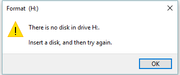

# Topics
* file i/o,
* binary data, and
* file representation and file signatures.

# TL;DR
Implement a program to recover lost business documents from a corrupted hard
drive.

This exercise will give you a better understanding and appreciation for
filesystems and document storage.

# Background
Like the good tax payer that I am, I keep copies of tax documents for up to six
years\textemdash per the recommendation by the IRS. Since I accumulate many
documents over that time period, it would be inconvenient to keep hard-copies of
them all, not to mention that I would have to store and organize all of them
somewhere. Instead, I generally keep soft-copies (digital copies) of them which
can be easily stored and require almost no space. I typically do this, by
taking pictures of each of the documents with a digital camera. The other day, I
was digitizing some of my documents in preparation for the upcoming tax season
when I saw this:



Unfortunately, I somehow corrupted the SD card. Both my Mac and PC refuse to
recognize the card now as having any photos, even though I'm certain that I took
them. Did I just lose six years worth of tax documents? Both operating systems
want to format the card, but, thus far, I've refused to let them, hoping instead
someone can come to the rescue.

Write a program called `ImageRecover` that recovers these photos. (Please!)

OMG, what?

Well, here's the thing: JPEGs have "*signatures*", [patterns of
bytes](https://en.wikipedia.org/wiki/File_format#Magic_number) that distinguish
them from other file formats. A list of common file signatures can be found
[here](https://en.wikipedia.org/wiki/List_of_file_signatures). In fact, most
JPEGs begin with one of two sequences of bytes. Specifically, the first four
bytes of most JPEGs are either

```
255 216 255 224
```

or

```
255 216 255 225
```

from first byte to fourth byte, left to right. Odds are, if you find one of
these patterns of bytes on a disk known to store photos (e.g., my SD card), they
demark the start of a JPEG.

Fortunately, digital cameras tend to store photographs contiguously on SD cards,
whereby each photo is stored immediately after the previously taken photo.
Accordingly, the start of a JPEG usually demarks the end of another. However,
digital cameras generally initialize SD cards with a FAT filesystem whose block
size is 512 bytes (B). The implication is that these cameras only write to those
cards in units of 512 B. A photo that's 1 MB (i.e., 1,048,576 B) thus takes up
1048576 ÷ 512 = 2048 blocks on a SD card. But so does a photo that's, say, one
byte smaller (i.e., 1,048,575 B)! The wasted space on disk is called [slack
space](https://en.wikipedia.org/wiki/Fragmentation_(computing)#Internal_fragmentation).
Forensic investigators often look at slack space for remnants of suspicious
data.

The implication of all these details is that you, the investigator, can probably
write a program that iterates over a copy of my SD card, looking for JPEG
signatures. Each time you find a signature, you can open a new file for writing
and start filling that file with bytes from my SD card, closing that file only
once you encounter another signature. Moreover, rather than read my SD card's
bytes one at a time, you can read 512 of them at a time into a buffer for
efficiency's sake. Thanks to FAT, you can trust that JPEG signatures will be
"block-aligned." That is, you need only look for those signatures in a block's
first four bytes.

\begin{tikzpicture}[font=\ttfamily,noname/.style={text height=1.5ex, text depth=.25ex, text centered, minimum height=3em}]
  \node[noname] at (-.7,.24) {\scriptsize\textbf{card.raw}};
  \foreach \x in {0,.4,...,3.7,4.4,4.8,...,8.1,8.8,9.2,...,10.5,12.8,13.2,...,14.5} {
    \draw (\x,0) rectangle ++(.4,.4);
    \draw[white, ultra thick] (\x-.1,.4) -- ++(.6,0);
  }

  \foreach \x in {4,8.4} {
    \draw[snake=zigzag,line before snake=.1em,segment amplitude=1pt,segment
      length=3pt] (\x,0) -- ++(.4,0);
  }
  \draw[snake=zigzag,line before snake=.1em,segment amplitude=1pt,segment
    length=3pt] (10.8,0) -- ++(2,0);

  \foreach [count=\i,evaluate=\i as \x using .2+(\i-1)*.4*1]
    \c in {235,060,144,109,\footnotesize$\cdots$,000,000,000,000,\footnotesize$\cdots$,,255,216,255,225,\footnotesize$\cdots$,000,000,146,145,\footnotesize$\cdots$,,255,216,255,225,\footnotesize$\cdots$,,,,,,099,015,026,161,\footnotesize$\cdots$} {
    \node[noname] at (\x,.25) {\tiny \c};
  }

  \foreach \x/\label in {0/Block \#1,2/Block \#2,4.4/Block \#625,6.4/Block \#626,8.8/Block \#1027,12.8/Block \#14500} {
    \draw[decoration={brace,amplitude=5pt,raise=1pt},decorate] (\x,.4) --
      node[above=6pt] {\scriptsize\label} ++(2.0,0);
  }

  \foreach \x/\length\label in {0/4.4/Bookkeeping,4.4/4.4/JPEG \#1,8.8/6/JPEG \#2\textendash 5} {
    \draw[decoration={brace,mirror,amplitude=5pt,raise=2pt},decorate] (\x,0) --
      node[below=6pt] {\scriptsize\label} ++(\length,0);
  }
\end{tikzpicture}

Realize, of course, that JPEGs can span contiguous blocks. Otherwise, no JPEG
could be larger than 512 B. But the last byte of a JPEG might not fall at the
very end of a block. Recall the possibility of slack space. Fortunately, I
bought a brand-new SD card for my stroll about campus. Odds are, that SD card
was "zeroed" (i.e., filled with 0s) by the manufacturer. Because I didn't
outright delete any photos we took, the only bits on that SD card should belong
to actual photos or be 0s. And it's okay if some trailing 0s (i.e., slack space)
end up in the JPEGs your program spits out; they should still be viewable.

Since I've but one SD card, I've gone ahead and created a "[forensic
image](https://en.wikipedia.org/wiki/Disk_image)" of the card, storing its
contents, byte after byte, in a file called `card.raw`. So that you don't waste
time iterating over millions of 0s unnecessarily, I've only imaged the first few
MB of the SD card. You should find that this image contains a whole bunch of
JPEGs.

# Instructions

1. Launch the VS Express 2013 software and open the project called
   `ImageRecovery_Part1` inside of your lab folder.

   Complete the action for `btnRecover` so that it reads the first byte from the
   file `card.raw`. To read a byte from a file, you must open the file in a
   new mode, `OpenMode.Binary`{.vbnet}, so that you have access to the data in
   the file in its finest granularity, i.e., the byte. So you would say:

   ```vbnet
   FileOpen(1, "card.raw", OpenMode.Binary, OpenAccess.Read)
   ```

   The additional input to `FileOpen()`{.vbnet}, namely
   `OpenAccess.Read`{.vbnet}, is required to indicate that you are wanting to
   input data from the file. If you were wanting to save data to the file, you
   would instead say:

   ```vbnet
   FileOpen(1, "card.raw", OpenMode.Binary, OpenAccess.Write)
   ```

   Since you did not use `OpenMode.Input`{.vbnet} you cannot use `Input()` to
   get values from the file. Instead you must use the function `FileGet()`. This
   function behaves very similar to `Input()`, but with some small difference
   that will be advantageous later in the lab. So, to read a byte from the file
   and put it into a `Byte`{.vbnet} variable called `b`, you would say:

   ```vbnet
   FileGet(1, b)
   ```

   To check that you have successfully read the first byte from the file, you
   should create a simple output statement with the following format:

   ```vbnet
   outResults.Text = "Byte #1 is " & String.Format("{0:000}", b)
   ```

   which should give you the following output when run:

   ```
   Byte #1 is 235
   ```

   For information about the meaning of the format string `"{0:000}"`{.vbnet},
   refer to the write-up for Lab 06 Part I.

   \BEGIN{Rubric}
   Checkpoint 1 (30/100)
   * project populates a `Byte` variable with the first byte from the file
     `card.raw`
   * project produces correctly formatted output according to the example above

   \END{Rubric}

   \newpage

1. Copy and paste the folder `ImageRecovery_Part1`. Rename the copy
   `ImageRecovery_Part2`. Launch the VS Express 2013 software and open the
   project `ImageRecovery_Part2`.

   Now, as mentioned in [Background](#background), data was stored on my SD card
   in blocks of 512 bytes. So, instead of reading each byte individually and
   determining whether each byte belongs to a JPEG or not, it would be much
   more appropriate to read a block of 512 bytes at a time and make a
   determination as to whether the block belongs to a JPEG or not by looking at
   the first four bytes in the block. Fortunately, with a slight change to the
   code for reading a single byte, we can read 512 bytes from the file. In this
   case, the only change required is our declaration of the variable `b`.
   Instead of declaring it as a `Byte`{.vbnet}, it should be declared as an
   array of `Byte`{.vbnet} values of length 512. With this small change, the
   call to `FileGet()` from before will now read 512 bytes from the file into
   the array called `b`.

   Test your code by outputting the first four bytes in the array `b`. You
   should get the following output when run:

   ```
   Block #1 has: 235 060 144 109
   ```

   \BEGIN{Rubric}
   Checkpoint 2 (65/100)
   * project populates a `Byte` array of length 512 with the first 512 bytes
     from the file `card.raw`
   * project produces correctly formatted output according to the example above

   \END{Rubric}

   \newpage

1. Copy and paste the folder `ImageRecovery_Part2`. Rename the copy
   `ImageRecovery_Part3`. Launch the VS Express 2013 software and open the
   project `ImageRecovery_Part3`.

   Update the action for button `btnRecover` so that instead of outputting the
   header for the first block only, the project outputs headers for every block
   in the file. The output should have the following format:

   ```
   Block #00001 has 235 060 144 109
   Block #00002 has 000 000 000 000
   Block #00003 has 000 000 000 000
   ...
   Block #00017 has 248 255 255 255
   Block #00018 has 001 001 002 001
   ...
   Block #14499 has 197 193 211 149
   Block #15000 has 099 015 026 161
   -----
   Total blocks in file: 14500
   ```

   \BEGIN{Rubric}
   Checkpoint 3 (70/100)
   * project produces correctly formatted output according to the example above

   \END{Rubric}

   \newpage

1. Copy and paste the folder `ImageRecovery_Part3`. Rename the copy
   `ImageRecovery_Part4`. Launch the VS Express 2013 software and open the
   project `ImageRecovery_Part4`.

   Next, update the action again so that instead of outputting the header for
   every block in the file, the projects outputs headers only for those blocks
   that signify the beginning of a JPEG. For this lab, you need only check for
   the header `255 216 255 225`, since this is the header used by my particular
   camera. The output should have the following format:

   ```
   JPEG #01 starts @ Block #00625
   JPEG #02 starts @ Block #01027
   JPEG #03 starts @ Block #01596
   JPEG #04 starts @ Block #01656
   JPEG #05 starts @ Block #08857
   -----
   Total JPEGs in file: 5
   ```

   \BEGIN{Rubric}
   Checkpoint 4 (75/100)
   * project produces correctly formatted output according to the example above

   \END{Rubric}

   \BEGIN{Submission}
   **Submission Instructions**

   During our next lab meeting, you will be asked to expand your solutions to
   Part 4. Prior to the meeting, you are expected to

   * finish ALL parts of this lab,
   * study (again) any material you struggled with in this lab, and
   * study new material needed for the next lab

   You will submit your work for this lab and the next one together by midnight
   Thursday.
  \END{Submission}
